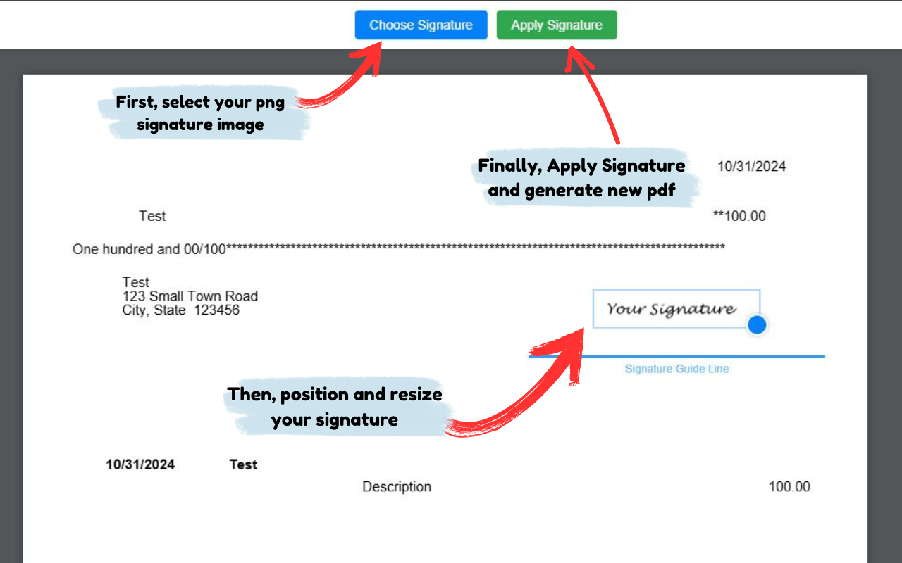

  

# QuickSign Chrome Extension

QuickSign is a Chrome extension that adds PNG signature images to PDF documents. It is specifically designed for signing QuickBooks Online PDF checks directly in your browser.

## Features

- **PDF Viewing**: Open and navigate through multi-page PDF documents in a built-in viewer
- **Signature Overlay**: Load a PNG signature image and position it anywhere on the document
- **Drag and Resize**: Easily position and resize your signature using intuitive controls
- **Multi-Page Support**: Applies your signature to all pages of the PDF automatically
- **Signature Guide**: Visual guide line helps position your signature correctly
- **Local Processing**: All document handling is performed locally in your browser for maximum privacy

## Chrome Web Store

## Installation (Developer Mode)

1. Clone this repository or download the ZIP file
2. Open Chrome and navigate to `chrome://extensions/`
3. Enable "Developer mode" in the top right corner
4. Click "Load unpacked" and select the extension directory

## Usage

1. Navigate to a PDF document in your browser (or open a PDF check from QuickBooks Online)
2. Click the QuickSign extension icon in your Chrome toolbar
3. The PDF opens in the QuickSign viewer
4. Click "Choose Signature" to select a PNG image of your signature
5. Drag the signature to position it on the document
6. Use the blue handle in the bottom-right corner to resize the signature
7. Click "Apply Signature" to embed the signature on all pages and download the signed PDF

## How It Works

The extension intercepts PDF pages and opens them in a custom viewer. When you add a signature:

1. The PNG image is overlaid on the PDF canvas at your chosen position
2. When you save, the extension uses PDF-lib to embed the image directly into the PDF
3. The signature is applied to every page of the document at the same position
4. A new PDF is generated and downloaded to your computer

## Technical Details

The extension is built with vanilla JavaScript and uses the following libraries:

- **PDF.js** (Mozilla) - PDF rendering and viewing
- **PDF-lib** - PDF manipulation and modification

## Permissions

- `activeTab` - Access the current tab to detect PDF pages
- `scripting` - Inject scripts to detect PDF content
- `<all_urls>` - Required to open the viewer on any PDF URL

## Use Cases

- Signing QuickBooks Online PDF checks without printing
- Adding signatures to any PDF document directly in the browser
- Batch signing multiple pages with the same signature at consistent positions
